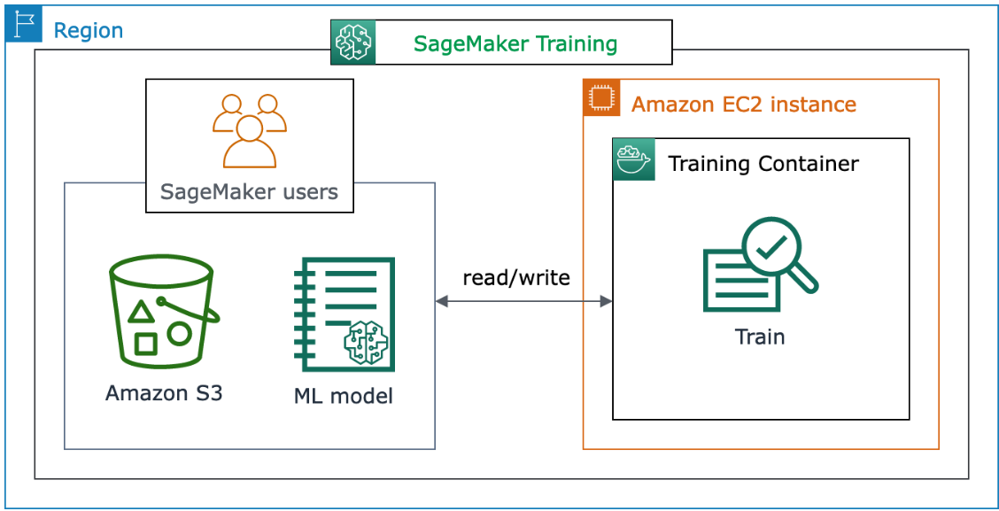

<h1 align="center" style="font-weight: bold;">Acomoda fácil 💻</h1>

<p align="center">
 <a href="#desenvolvimento-e-resultado">Desenvolvimento</a> • 
 <a href="#tecnologias-utilizadas">Tecnologias</a> • 
 <a href="#como-foi">Detalhamento</a> •
 <a href="#arquitetura">Arquitetura</a> •
 <a href="#pastas">Pastas</a> •
 <a href="#instruções">Como rodar</a>•
 <a href="#dificuldades-encontradas">Dificuldades</a> •
 <a href="#contribuidores">Contribidores</a>
</p>


Bem-vindo à documentação do sistema de previsão de valor de alugueis em hóteis, desenvolvido para aproveitar o poder do Amazon SageMaker. Este sistema é projetado para receber dados no formato JSON e fornecer uma previsão classificatória dos valores de aluguéis .


<h2 id="desenvolvimento-e-resultado"> 	📊 Desenvolvimento e resultado </h2>

- O sitema foi desenvolvido a partir do projeto de bolsas da Compass UOL/AWS. 
- A equipe se organizou em torno dos objetivos de criação da API e treinamento do modelo utilizando a plataforma AWS fornecida
- Com o esforço de todos na equipe, conseguimos um total de 86% de acurácia.


<h2 id="tecnologias-utilizadas"> 📎 Tecnologias Utilizadas </h2>

### Organização da equipe 

- **Trello** - Organização da equipe de desenvolvimento.
- **Git** - Controle de versão e elaboração do sistema.

### API e aprendizagem de máquina
- **Python (3.12.3)** - Linguagem da API.
- **FastAPI** - Framework para o desenvolvimento da API.
- **uvicorn** - Servidor para aplicações web assíncronas em Python.
- **boto3** - Biblioteca AWS SDK para interagir com os recursos.
- **scikit-learn** - Biblioteca de machine learning utilizada para ferramentas de análise e modelagem de dados.
- **pydantic** - Biblioteca de validação de dados, também utilizada para garantir o recebimento de dados no formato correto.
- **joblib** - Biblioteca Python utilizada para salvar e carregar modelos treinados.
- **pandas** - Biblioteca utilizada para ler e escrever dados em vários formatos de arquivo.
- **XGBoost** - Biblioteca de machine learning utilizada para otimizar os processos de compressão de dados.
- **SageMaker** - Serviço para treinar e desenvolver modelos de macinhe Learning 
- **Jupyter Notebooks** - Execução dos códigos
### Contêineres e banco de dados 
- **Docker Compose** - Plataforma para executar os contêineres, melhorando o deploy e o processamento do sistema. 
- **PyMySQL (1.1.1)** - Biblioteca Python utilizada para consultas, inserções, atualizações e deleções de registros em bancos de dados MySQL.
- **S3** - Armazenar o modelo.


<h2 id="como-foi"> 🔎 Como Foi Alcançado Este Resultado de Modelo </h2>

Primeiramente, foram selecionadas as primeiras 29 colunas para fazer o conjunto de testes (Caso queira analisar e saber como escolhemos cada coluna, você pode executar o notebook que está localizado nas pastas `notebooks\exploratory`). Depois, foram decididos os hiperparâmetros do modelo.

### Hiperparâmetros

- **Objective** - Foi decidido usar `multi:softmax`, pois a classificação poderia prever três classes distintas, conforme especificado em `num_class`.

- **Eval_metric** -
Foi escolhido `mlogloss`, pois ele é uma métrica que prevê a eficácia do modelo em treinamento, caracterizado por penalizar previsões incorretas de forma exponencial.

- **Gamma, Lambda** -
Os valores de gamma razoavelmente alto, `0.6307...`, e o moderado de lambda, `0.138...`, foram escolhidos para evitar overfitting. Um previne a criação de partições desnecessárias, e o outro ajuda a adicionar regularização aos pesos, mantendo o modelo simples, respectivamente.

- **Colsample_bytree** - 
O valor `0.958...` foi escolhido para permitir que a maioria das colunas seja usada em cada árvore, garantindo que o modelo utilize a maior parte da informação disponível.

- **Eta** -
Para a taxa de aprendizado, foi escolhido um valor baixo de `0.05`, para garantir que o modelo aprenda de forma gradual, também prevenindo overfitting.

- **Max_depth** - 
Com a cautela utilizada no `gamma` e `lambda` para evitar overfitting, decidimos arriscar um número alto, `9`, para capturar o máximo de interações complexas nos dados.

- **Min_child_weight** -
Ele especifica a soma mínima de pesos, por isso o valor moderado de `2.62...` foi escolhido, para garantir que nós filhos não sejam criados a menos que contenham um número significativo de amostras.

- **Subsample** -
Foi decidido utilizar a maior quantidade de dados de treinamento possível, `0.95...`, mas não todos, para evitar o risco de overfitting.

- **Num_round** -
Após vários testes, foi percebido que uma quantidade adequada de rodadas de boosting era 1000.

____
A conclusão dos hiperparâmetros utilizados neste modelo de XGBoost foi alcançada a partir de um extenso processo de tuning. Esse processo envolveu testar várias combinações de hiperparâmetros para identificar a configuração que proporcionasse a melhor acurácia e desempenho geral do modelo.

<h2 id="arquitetura"> 	✒️ Arquitetura </h2>



<h2 id="pastas"> 📂 Pastas </h2>


```
.
├── api/             # Diretório que contém a API do sistema.
│   ├── src/         # Código-fonte da aplicação, onde a lógica principal está implementada.
│   └── main         # Ponto de entrada da aplicação, onde a API é inicializada.
│   
├── data/            # Diretório que armazena os dados utilizados no sistema.
│   ├── external/    # Dados externos que serão utilizados para enriquecer a análise.
│   ├── processed/   # Dados já processados e prontos para uso nos modelos.
│   └── raw/         # Dados brutos, ainda sem processamento.
├── environment/     # Diretório para gerenciar ambientes virtuais ou configurações específicas.
├── notebooks/       # Diretório que contém os Jupyter Notebooks para análise e modelagem.
│   ├── exploratory/ # Notebooks para exploração inicial dos dados.
│   └── modeling/    # Notebooks focados na construção e avaliação dos modelos de machine learning.
├──scripts_ec2       # Scripts que serão executados na instância EC2. 
└── Dockerfile       # Arquivo de configuração para criar a imagem Docker da API.
```

<h2 id="instruções"> 📘 Instruções de Como Rodar </h2>

### Pré-requisitos
- Git
- Python (3.12.*)
- Docker
- Conta AWS
- AWS CLI
___
### Passo a Passo

#### I. Clone o Repositório:
   ```bash
   git clone -b grupo-2 --single-branch https://github.com/Compass-pb-aws-2024-MAIO-A/sprints-4-5-pb-aws-maio.git
   ```

#### II. Navegue até o Diretório:
   ```bash 
   cd sprints-4-5-pb-aws-maio
   ```
#### III. Criação do Arquivo .env:
Use como exemplo o arquivo `environment/.env.example` para criar um arquivo `.env` na raiz do projeto. Preencha os campos de acordo com as especificidades.

```env
PROFILE_NAME= Perfil da AWS
ROLE_ARN= Regras para usar o Sagemaker e o S3   
DB_INSTANCE_IDENTIFIER= Instancia do banco de dados RDS
DB_INSTANCE_CLASS= Classe da instancia
DB_ENGINE= MySQL                                                    #Obrigatório ser, por causa do PyMySQL
DB_NAME= Nome do banco de dados
DB_USER= Nome do usuário administrador
DB_PASSWORD= Senha do usuário administrador
DB_PORT=3306                                                        #Não necessáriamente esta, mas é aconselhável
DB_HOST=URL do banco de dados
DB_SUBNET_GROUP= Grupo de subredes onde a instância RDS será criada
```


#### IV. Instale as Dependências:
   ```bash
   pip install -r requirements.txt
   ```

#### V. Rode os Scripts:
Todos os arquivos citados estão localizados na pasta `data/`.

- Crie a instância:
   ```bash
   python create_rds_instance.py
   ```

- Conecte-se ao banco:
   ```bash
   python connect_db.py
   ```

- Carregue um DataFrame do CSV para o RDS:
   ```bash
   python db_load.py
   ```

- Obtenha os dados da tabela 'reservations':
   ```bash
   python get_rds_data.py
   ```

- Prepare e armazene os dados em outra tabela:
   ```bash
   python data_prepare.py
   ```

##### Observação sobre o Subnet Group
É necessário criar um DB Subnet Group no RDS. Se não existir uma subnet padrão, crie uma e adicione o parâmetro `DBSubnetGroupName` com o nome da subnet:

```
DBSubnetGroupName: nome_da_subnet
```


#### VI. Login da AWS CLI:
Confirme que está com as credenciais da AWS CLI corretas para conseguir logar e executar os notebooks. Você poderá fazer isto no arqurivo localizado na pasta `notebooks\modeling`.


#### VII. Preencha as credenciais do config:
Após receber os valores gerados pelo notebook. Preencha a credenciais do arquivo localizado na pasta `api\src\config`.

```py
   BUCKET_NAME ='your-bucket-aws-name'
   MODEL_KEY = 'path-to-model'
   HOST = '127.0.0.1'
   PORT = 9000
   PROFILE_NAME = 'name-of-your-aws-profile'
```
#### VIII. Execute o Arquivo Principal:
```bash
   uvicorn api.src.main:app --reload
```

#### IX. Crie a Execução Local do Docker Compose:
```bash
docker compose up -d
```

##### Observações Adicionais
- Configuração do Docker Compose: Certifique-se de que o arquivo docker-compose.yml está configurado corretamente na raiz do projeto. Se não estiver, forneça instruções para criá-lo.
- Ambiente Virtual: Recomenda-se criar um ambiente virtual para instalar as dependências:
```bash
   python -m venv venv
   source venv/bin/activate
   pip install -r requirements.txt
```
- Permissões e Políticas IAM: Verifique se o perfil da AWS tem permissões adequadas para criar e gerenciar instâncias RDS, acessar S3, e outras operações necessárias.

Pronto! Agora você pode acessar sua aplicação e vê-la funcionar.

<h2 id="dificuldades-encontradas"> 〽️ Dificuldades Encontradas </h2>

- Desenvolvimento do Ambiente Docker Compose
- Achar hiperparametros bons para alcançar uma boa acuráci.
- Integração da API com o modelo.

<h2 id="contribuidores">📫 Contribuidores</h2>

- Brian Rafael   - brian.trajano@compasso.com.br
- Ester Pequeno  - ester.trevisan@compasso.com.br
- Luiz Manoel    - luiz.dantas@compasso.com.br
- Ricardo Luiz   - ricardo.prado@compasso.com.br

###### versão 0.0.1